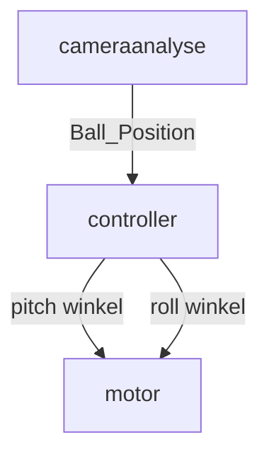

## Description

A package to transfer the camera infos as PID-controller's input and it's output signal to control the motors.

### Nodes, Topicflow and Msg-types

##### Structure:




##### Commands to test:

```python
cd dev_ws/
rosdep install -i --from-path src --rosdistro dashing -y	 
colcon build --packages-select controller_pid
ros2 run controller_pid <node_name>
```

|  package_name  |   node_name   |
| :------------: | :-----------: |
| controller_pid | cameraanalyse |
|                |  controller   |
|                |     motor     |

	##### Todo:

Interface from OpenMV to ROS
