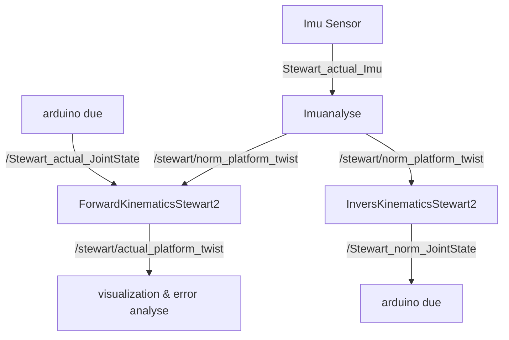

## Description

This package stewart2 realize the self balancing of a 6-DOF platform. It obtains information from an Imu-Sensor and outputs the control signal to the motors after moderate computing.

## Structure (actual)

|           Node            |            Message             |        Message Type         |
| :-----------------------: | :----------------------------: | :-------------------------: |
|        Imuanalyse         |  /stewart/norm_platform_twist  |   geometry_msgs/msg/Twist   |
| InverseKinematicsStewart2 |   /Stewart_actual_JointState   | sensor_msgs/msg/joint_state |
| ForwardKinematicsStewart2 |    /Stewart_norm_JointState    | sensor_msgs/msg/joint_state |
|                           | /stewart/actual_platform_twist |   geometry_msgs/msg/Twist   |
|                           |       Stewart_actual_Imu       |     sensor_msgs/msg/imu     |




## How to test

1. ### Install Micro-XRCE-DDS Agent (v1.1.0) 		

   Source: arduinoDUE在ROS2中的Publischer和Subscriber

   ```python
   git clone https://github.com/eProsima/Micro-XRCE-DDS-Agent.git
   cd Micro-XRCE-DDS-Agent && git checkout v1.1.0
   mkdir build && cd build
   source /opt/ros/dashing/setup.bash # to share libraries with ros2
   cmake ..
   make
   sudo make install
   sudo ldconfig /usr/local/lib/
   ```

   

2. ### Connect the model Stewart-Platform and Imu-Sensor to PC

   IMPORTANT:  Power Generator 12V	 **(avoid short circuit !!!)**

   

3. ### Connect them with ROS2 use following commands:

   ```python
   LD_PRELOAD="/usr/local/lib/libfastrtps.so.1" MicroXRCEAgent serial --dev /dev/ttyACM0 -b 115200
   LD_PRELOAD="/usr/local/lib/libfastrtps.so.1" MicroXRCEAgent serial --dev /dev/ttyACM1 -b 115200
   ```

   

4. ### Compile the Package and run the nodes

   Open a Terminal

   ```python
   cd dev_WS/
   colcon build --packages-select stewart2
   ros2 run stewart2 InverseKinematicsStewart2
   ```

   Open a new Terminal

   ```python
   ros2 run stewart2 ForwardKinematicsStewart2
   ```

   Open a new terminal

   ```python
   ros2 run stewart2 ImuAnalyse
   ```

   After running each nodes, you can use the following command to check the actual topic, their name and type. Open a new terminal:

   ```python
   ros2 topic list
   ```

   

### Others 

Source: ros2在terminal来pub信息

You can also publish as you wish (without the Imu-Sensor), for example:

```python
# geometry_msgs/msg/Twist
ros2 topic pub --once /cmd_vel geometry_msgs/msg/Twist "{linear: {x: 2.0, y: 0.0, z: 0.0}, angular: {x: 0.0, y: 0.0, z: 1.8}}"
# sonsor_msgs/JointState
ros2 topic pub --once /Stewart_norm_JointState sensor_msgs/JointState "{header: {stamp: {sec: 0, nanosec: 0}, frame_id: ""}, name: ["art1"], position: [150.0,5.0], velocity: [0.0], effort: [0.0]}"
# std_msgs/Float32MultiArray
ros2 topic pub --once stewart/norm_length std_msgs/Float32MultiArray "{layout: {dim: [{label: '', size: 0, stride: 0}], data_offset: 0}, data: [64, 64,64,64,64,64]}"
# geometry_msgs/PoseStamped
ros2 topic pub --once /move_base_simple/goal geometry_msgs/PoseStamped '{header: {stamp: {sec: 0, nanosec: 0}, frame_id: "map"}, pose: {position: {x: 1.0, y: 0.0, z: 0.0}, orientation: {w: 1.0}}}'
# 循环pub:
ros2 topic pub /move_base_simple/goal geometry_msgs/PoseStamped '{header: {stamp: {sec: 0, nanosec: 0}, frame_id: "map"}, pose: {position: {x: 1.0, y: 0.0, z: 0.0}, orientation: {w: 1.0}}}'

```

and watch the echo of the subscribers for example:

```python
ros2 topic echo /stewart/actual_platform_twist
```
